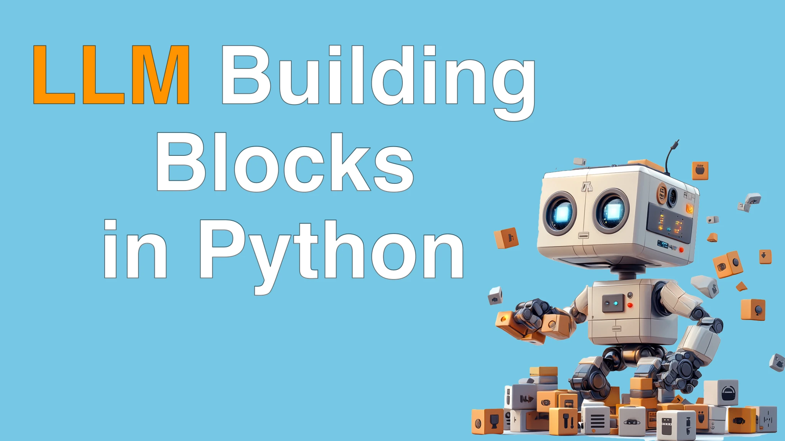

# LLM Building Blocks for Python Course 

Dive into **LLM Building Blocks for Python**, a concise 1.2-hour video course that equips you with everything you need to integrate large language models into your Python applications. You’ll learn to move beyond “text in → text out” by turning your prompts into structured data, orchestrating chat-style workflows, and building interactive prototypes. From rapid-fire notebook experiments to production-ready async pipelines and caching, this course gives you practical, code-first techniques for real-world LLM development.

## What topics are covered

By the end of this course, you’ll be able to:

- Set up and use **Marimo** for live, reactive notebook experiments
- Install and configure the **llm** library and its plugins for multiple vendors
- Craft prompts with **Pydantic schemas** to enforce structured JSON outputs
- Build and manage **chat conversations** programmatically in Python
- Orchestrate **async LLM calls** and understand concurrency limits
- Implement **disk caching** to save tokens, speed up development, and cut costs
- Measure classification accuracy and **benchmark LLM vs. scikit-learn** pipelines
- Conduct **A/B tests** on prompts to iteratively refine model outputs
- Explore higher-level tools like **smartfunk**, **Mirascope**, **Ollama**, and **Instructor**
- Design small “apps” inside Marimo to automate tasks such as YouTube transcript summarization

## Who Should Take This Course?

- **Python developers** curious about adding LLM features to scripts, tools, or web apps
- **Data scientists** wanting to prototype NLP workflows without deep ML expertise
- **DevOps/automation engineers** looking to integrate AI-driven tasks into pipelines
- **Tech leads** and architects evaluating LLM toolchains for production use
- **Educators and researchers** who need structured LLM interactions in their code

## Take the course

Visit [Talk Python Training](https://training.talkpython.fm/courses/llm-building-blocks-for-python) to take the course for just $19 USD.

